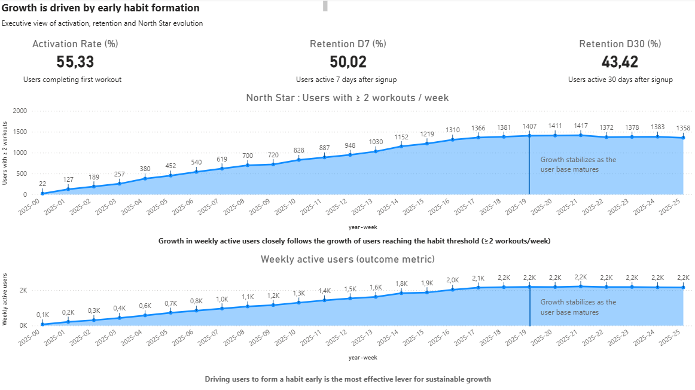
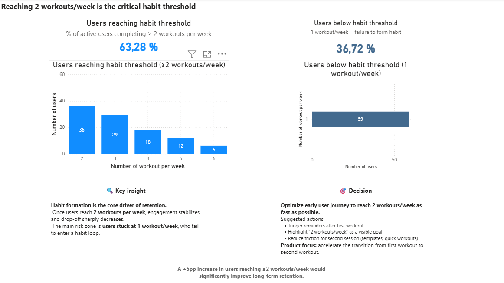
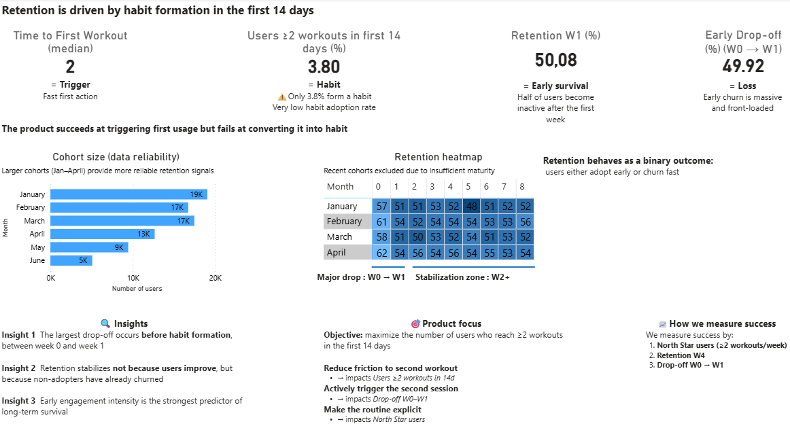

# 💪 Fitness Habit Formation & Retention Analytics

> How early user behavior predicts long-term retention — a product analytics deep dive into the first 14 days.


---

## 👤 About This Project

I'm **Antoine Moineaux**, Data Analyst. This is the **2nd project in my portfolio**, focused on product analytics: understanding user behavior, identifying retention levers, and turning data into concrete product recommendations.

Each of my projects showcases a different facet of the data analyst role:

| # | Project | Skills Demonstrated |
|---|---------|-------------------|
| 1 | [Mobility Operations Performance](https://github.com/AntoineMoineaux/mobility-operations-performance) | SQL pipeline, Power BI, operational KPIs, priority framework |
| **2** | **This project — Fitness Retention** | **Product analytics, cohort analysis, retention diagnosis, North Star metric** |
| 3 | [TFC Recruitment Analysis](https://github.com/AntoineMoineaux/tfc-recruitment-analysis) | Custom scoring framework, advanced DAX, decision support, domain expertise |

📫 **Contact me**: [LinkedIn](https://www.linkedin.com/in/antoine-moineaux-37a0b6189) · [Email](mailto:antoine.moineaux@gmail.com)

---

## TL;DR

A simulated fitness app with growing signups but poor conversion to long-term users. Analysis of user behavior reveals that **retention is decided within the first 14 days**: only **3.8% of users form the exercise habit** (≥2 workouts/week) in that window, and **50% of users churn between week 0 and week 1**. The product lever isn't long-term engagement — it's **early activation speed**.

---

## Table of Contents

- [Business Context](#business-context)
- [Key Metrics](#key-metrics)
- [Core Insight](#core-insight)
- [The 3 Dashboards](#the-3-dashboards)
- [Analytical Approach](#analytical-approach)
- [Dataset & Assumptions](#dataset--assumptions)
- [Limitations & Trade-offs](#limitations--trade-offs)
- [Next Steps](#next-steps)
- [Repo Structure](#repo-structure)
- [How to Run](#how-to-run)
- [Skills Demonstrated](#skills-demonstrated)

---

## Business Context

A fitness app is experiencing growth in signups but struggles to convert new users into long-term active users.

**Mission**: Identify the primary retention lever and propose concrete product actions based on data.

**Key questions**:
1. Where exactly in the user journey do we lose people?
2. What behavior separates retained users from churned users?
3. When is the critical window to intervene?
4. What product actions would have the highest impact on retention?

---

## Key Metrics

| Metric | Value | Interpretation |
|--------|-------|---------------|
| **Activation Rate** | 55.33% | More than half of signups complete their 1st workout |
| **Retention D7** | 50.02% | Half abandon within the first week |
| **Retention D30** | 43.42% | Stabilization after the first month |
| **Users ≥2 workouts/week** | 63.28% | 2 out of 3 active users form a habit |
| **Habit formation (14 days)** | **3.80%** | Critical point: very few convert quickly |
| **Early drop-off (W0→W1)** | 49.92% | Half leave before forming a habit |

---

## Core Insight

**Retention is not won over months — it's decided within the first 14 days.**

The data shows a clear pattern:
- Users reaching ≥2 workouts/week show stable, long-term retention rates
- Users stuck at 1 workout/week abandon massively
- The major drop-off occurs between W0 and W1 (50% loss)
- Only 3.80% of users form the habit within the first 14 days
- Retention stabilizes not because users improve, but because non-adopters have already churned

→ This is not a long-term engagement problem. It's an **early conversion problem**.

---

## The 3 Dashboards

The analysis is structured as a 3-act narrative, each dashboard answering one key product question.

### Dashboard 1 — Executive Overview
*"Growth is driven by early habit formation"*

Evolution of users reaching the ≥2 workouts/week threshold (North Star). Direct correlation between this number and WAU growth. Activation rate, D7 and D30 retention as main KPIs.

**Insight**: WAU growth follows users who formed a habit. Increasing users reaching ≥2 workouts = sustainably increasing WAU.



### Dashboard 2 — Uses & Habits
*"Reaching 2 workouts/week is the critical habit threshold"*

Distribution of users by weekly workout count: 63.28% reach the ≥2 threshold, 36.72% remain stuck at 1 workout/week (risk zone).

**Insight**: There's no gray zone. Users either cross the 2-workout threshold and stay, or remain at 1 and leave. Retention is **binary**.

**Product recommendation**: Optimize the user journey to reach 2 workouts/week as quickly as possible — trigger reminders after the 1st workout, create onboarding that pushes toward the 2nd workout in week 1, reduce friction with quick workout templates. Estimated impact: +5pp of users reaching ≥2 workouts/week.



### Dashboard 3 — Retention & First 14 Days
*"Retention is driven by habit formation in the first 14 days"*

Median time to 1st workout: 2 days (the product succeeds in triggering the first action). But only 3.80% reach ≥2 workouts within the first 14 days. Retention heatmap by cohort (Jan–April) showing stabilization from W2.

**Product focus**: Maximize the number of users reaching ≥2 workouts within the first 14 days. Success metrics: % of users with ≥2 workouts/week (North Star), Retention W4 (proxy for long-term retention), Drop-off W0→W1 (leading indicator).



---

## Analytical Approach

The analysis follows a 4-step product analytics framework:

**1. North Star Metric Definition** — Why "≥2 workouts/week"? It's correlated with retention, actionable by product, and measurable quickly.

**2. User Funnel Analysis** — Activation → First use → Habit formation → Long-term retention. Friction point identified: the transition from 1 to 2 workouts/week.

**3. Cohort Analysis** — Jan–April cohorts (19K, 17K, 17K, 13K users) all show the identical retention pattern: massive W0→W1 drop, then stabilization. The pattern is structural, not seasonal.

**4. Insights → Decisions → Actions** — Each dashboard ends with a concrete product recommendation and estimated expected impact.

---

## Dataset & Assumptions

| Parameter | Value |
|-----------|-------|
| **Type** | Synthetic dataset simulating a fitness mobile app |
| **Granularity** | One row per workout event |
| **Aggregation** | Weekly at user level |
| **Inactive definition** | No activity in a given week |
| **Retention definition** | User has ≥1 workout in the target week |

The goal is not data realism, but realistic **product behavior patterns**.

---

## Limitations & Trade-offs

- **Synthetic data** — no real user behavior; results are illustrative but patterns are realistic
- **No acquisition channel data** — can't segment retention by source, which limits targeting recommendations
- **Descriptive analysis only** — diagnosis and prioritization, no A/B testing or predictive modeling
- **Fixed thresholds** — the ≥2 workouts/week habit threshold is data-informed but would normally be validated with product teams
- **No workout type/duration** — all workouts are treated equally regardless of intensity or length

---

## Next Steps

- A/B test onboarding flows to push the second workout faster
- Segment retention by acquisition channel to identify highest-quality sources
- Track time between first and second workout as a core activation metric
- Experiment with habit nudges (notifications, streaks, social features)

---

## Repo Structure

```
📂 fitness-retention-analysis/
├── 📄 README.md
├── 📂 assets/
│   ├── projet-2-dashboard1.png
│   ├── projet-2-dashboard2.png
│   └── projet-2-dashboard3.png
├── 📂 docs/
└── 📂 sql/
```

---

## How to Run

1. **SQL queries**: Execute the scripts in `/sql/` using SQLiteStudio or any SQLite-compatible tool
2. **Dashboards**: Screenshots available in `/assets/` — Power BI file available locally
3. **Reading order**: Executive Overview → Uses & Habits → Retention & First 14 Days

---

## Skills Demonstrated

| Skill | Application in this project |
|-------|---------------------------|
| **SQL (cohort analysis)** | Window functions, weekly aggregation, conditional metrics, retention by cohort and week offset |
| **Power BI** | 3 narrative dashboards with DAX measures, data modeling, and storytelling structure |
| **Product analytics** | North Star metric definition, funnel analysis, habit threshold identification |
| **Retention analysis** | Cohort heatmaps, W0→W1 drop-off diagnosis, habit formation rate tracking |
| **Data storytelling** | 3-act narrative structure: diagnosis → insight → actionable recommendation with estimated impact |
| **Business communication** | Adapting message to audience (executive summary vs. deep dive), prioritizing information |

---

> *This project uses synthetic data and is part of a data analytics portfolio. The goal is to demonstrate product analytics methodology and decision-oriented thinking, not data realism.*
